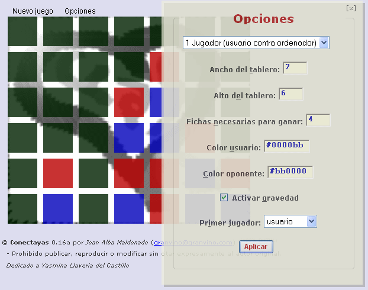

Conectayas 
========== 
by Joan Alba Maldonado (joanalbamaldonadoNO_SPAM_PLEASE AT gmail DOT com, without NO_SPAM_PLEASE)

"Connect 4" and "Tic-Tac-Toe" and more alike games totally written in DHTML. Highly configurable.

Version: 0.17a 
- Date: 12th September 2006 (approximately).

You can donate at http://sourceforge.net/donate/index.php?group_id=177497

## Description

Open source Tic-tac-toe, Connect four (aka Four in a row) and similar style games (highly configurable) totally written in DHTML (HTML, CSS and JavaScript).

It is my seventh DHTML game and was made in late 2006.

In fact, this game is not only a game but many since the player can configure it to play Tic-tac-toe, Connect-4 and other similar games. You can configure the number of human players (1 or 2 players), who will start playing first (first player or second player which can be either the computer or a human), board size, the necessary pieces in a line to win, the colour of the pieces and choose whether to use gravity or not (with gravity the pieces will fall down as in Connect-four).

You can also change the game behaviour easily by editing many of the configuration variables which are at the beginning of the script. To change the backgrounnd image you just need to replace it with another one.

This game only uses one image for the background which is not necessary to make it work, so all the rest you can see has been made using just pure HTML and CSS.

Official languages are Spanish and English.

You can find other modified and adapted versions of this game on the Internet, including one Opera widget and even a Drupal module found at https://www.drupal.org/project/connectiv

This game has been tested under BeOS, Linux, NetBSD, OpenBSD, FreeBSD, Windows, Mac OS X, BlackBerry Tablet OS, Android, iOS and others.

Play online in English: http://conectayas.tuxfamily.org/conectayas_english/

Play online in English (mirror): http://www.dhtmlgames.com/conectayas/conectayas_english/

Play online in Spanish: http://conectayas.tuxfamily.org/conectayas_spanish/

Play online in Spanish (mirror): http://www.dhtmlgames.com/conectayas/conectayas_spanish/

Official web site: http://conectayas.tuxfamily.org/ (mirror at http://www.dhtmlgames.com/conectayas/).

## License

This project can be used, reproduced, distributed and modified freely for any non-commercial purposes but always keeping the author's name and copyright clauses. Other than that, just use this project as you wish but never sell it!